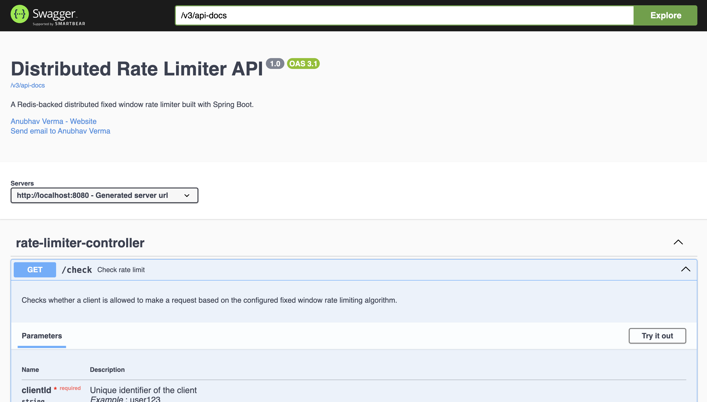
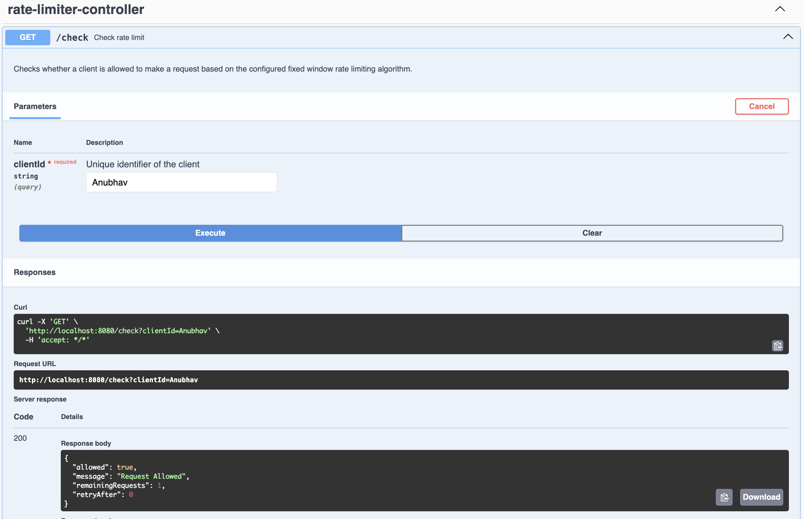
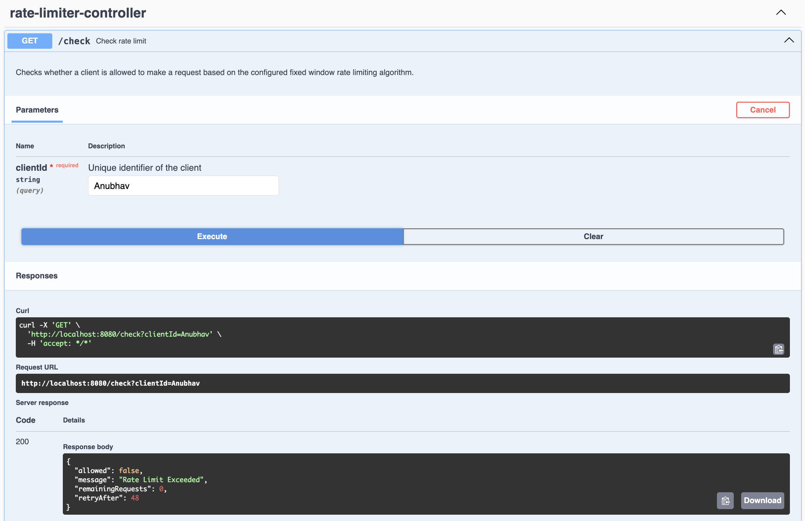
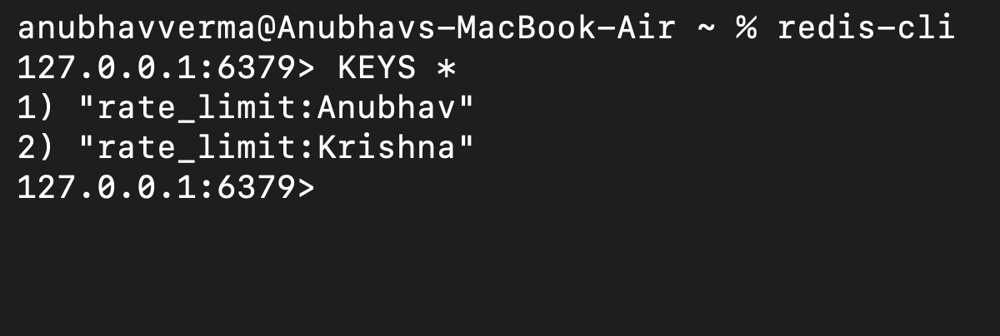
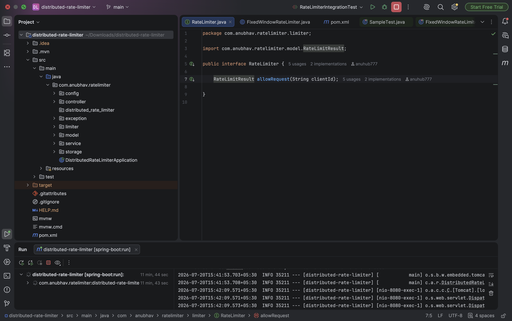

# 🚀 Distributed Rate Limiter API

A production-inspired **Distributed Rate Limiter** built using **Spring Boot** and **Redis**. This project demonstrates how to efficiently control request rates across distributed systems using the **Fixed Window Rate Limiting** algorithm.

---

## ✨ Features

- ✅ Fixed Window Rate Limiting Algorithm
- ✅ Redis-backed distributed storage
- ✅ Configurable request limits and time windows
- ✅ RESTful API built with Spring Boot
- ✅ Dockerized Redis setup
- ✅ Swagger / OpenAPI documentation
- ✅ Global exception handling
- ✅ Unit testing with JUnit & Mockito
- ✅ Integration testing with MockMvc

---

## 🛠 Tech Stack

- Java 21
- Spring Boot 3
- Spring Web
- Spring Data Redis
- Redis
- Docker
- Maven
- JUnit 5
- Mockito
- MockMvc
- Swagger / OpenAPI

---

## 📁 Project Structure

```text
src
├── main
│   ├── java
│   │   ├── config
│   │   ├── controller
│   │   ├── exception
│   │   ├── limiter
│   │   ├── model
│   │   ├── service
│   │   └── storage
│   └── resources
└── test
    └── java
```

---

## 🏗️ System Architecture

```text
                    Client
                       │
                       ▼
             ┌─────────────────┐
             │  REST Controller │
             └────────┬────────┘
                      │
                      ▼
            ┌──────────────────┐
            │ RateLimiterService│
            └────────┬─────────┘
                     │
                     ▼
        ┌─────────────────────────┐
        │ FixedWindowRateLimiter  │
        └────────┬────────────────┘
                 │
                 ▼
      ┌──────────────────────────┐
      │ RedisRateLimitStorage    │
      └────────┬─────────────────┘
               │
               ▼
             Redis
```

---

## 🔄 Request Flow

1. Client sends a request with a unique `clientId`.
2. The controller forwards the request to the service layer.
3. The Fixed Window Rate Limiter increments the request count in Redis.
4. If this is the first request in the current window, a TTL is assigned to the Redis key.
5. The limiter compares the request count with the configured limit.
6. If the limit has not been exceeded, the request is allowed.
7. Otherwise, the request is rejected and the client receives the retry information.

---

## 📊 Example

Assume:

- Maximum Requests = **5**
- Window Size = **60 seconds**

| Request | Count | Result |
|---------:|------:|--------|
| 1 | 1 | ✅ Allowed |
| 2 | 2 | ✅ Allowed |
| 3 | 3 | ✅ Allowed |
| 4 | 4 | ✅ Allowed |
| 5 | 5 | ✅ Allowed |
| 6 | 6 | ❌ Rate Limit Exceeded |

After the 60-second window expires, the counter resets automatically.

---

## 💡 Why Redis?

Redis was chosen because it provides:

- Extremely low latency
- Atomic operations
- Automatic key expiration (TTL)
- High performance for distributed systems
- Easy horizontal scalability

Using Redis ensures that rate limits remain consistent even when multiple instances of the application are running.

---

## 📡 API Endpoint

### Check Rate Limit

```http
GET /check?clientId=user123
```

### Successful Response

```json
{
  "allowed": true,
  "message": "Request Allowed",
  "remainingRequests": 4,
  "retryAfter": 0
}
```

### Rate Limit Exceeded

```json
{
  "allowed": false,
  "message": "Rate Limit Exceeded",
  "remainingRequests": 0,
  "retryAfter": 42
}
```

---

## 📄 Response Headers

| Header | Description |
|--------|-------------|
| X-RateLimit-Limit | Maximum requests allowed |
| X-RateLimit-Remaining | Remaining requests in the current window |
| Retry-After | Time until the client can retry |

---

## 📸 Screenshots

### Swagger UI



---

### Successful Request



---

### Rate Limit Exceeded



---

### Redis Storage



---

### Project Structure



---

## 🧪 Testing

This project includes:

- Unit Tests for the Fixed Window Rate Limiter
- Integration Tests using MockMvc
- Redis-backed end-to-end request validation

---

## 📚 API Documentation

Swagger UI is available after starting the application:

```text
http://localhost:8080/swagger-ui/index.html
```

---

## 🚀 Running the Project

### Clone the repository

```bash
git clone https://github.com/anuhub777/distributed-rate-limiter.git
cd distributed-rate-limiter
```

### Start Redis

```bash
docker run -d \
  --name redis-rate-limiter \
  -p 6379:6379 \
  redis:7-alpine
```

### Run the application

```bash
mvn spring-boot:run
```

The application will be available at:

```text
http://localhost:8080
```

API Endpoint:

```http
GET http://localhost:8080/check?clientId=user123
```

---

## 🎯 Learning Outcomes

Through this project, I gained hands-on experience with:

- Designing RESTful APIs using Spring Boot
- Implementing the Fixed Window Rate Limiting algorithm
- Integrating Redis for distributed request tracking
- Writing Unit Tests with JUnit & Mockito
- Writing Integration Tests with MockMvc
- Using Docker for infrastructure setup
- Documenting APIs with Swagger/OpenAPI
- Structuring scalable backend applications

---

## 🔮 Future Improvements

- Sliding Window Rate Limiter
- Token Bucket Rate Limiter
- Per-IP Rate Limiting
- Per-Endpoint Rate Limiting
- Metrics & Monitoring
- Docker Compose Support

---

## 👨‍💻 Author

**Anubhav Verma**

GitHub: https://github.com/anuhub777

If you found this project useful, consider giving it a ⭐ on GitHub!
